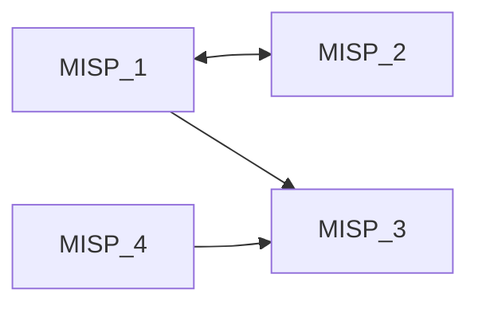

# MISP Synchronisation


**MISP Synchronisation** is a project aimed at facilitating the local deployment of multiple instances of [MISP](https://www.misp-project.org/) and the configuration of their synchronisation connections.
It relies on the [MISP Docker](https://github.com/MISP/misp-docker) repository to easily deploy the different instances in containers.

In addition, this project includes a set of synchronisation tests based on the [PyMISP](https://github.com/MISP/PyMISP/) library to verify that data sharing between instances is working properly.

---

## 🚀 Main features

* **Automated deployment**: installation and configuration of ready-to-use MISP instances.
* **Containerization with Docker**: each instance is isolated and reproducible.
* **Automated testing**: Python scripts to validate inter-instance synchronisation.

---

## 📋 Prerequisites

Before installing and using this project, make sure your host system meets the following requirements:

* **Operating system**

  * [Ubuntu 22.04 LTS (Jammy Jellyfish)](https://releases.ubuntu.com/jammy/)
* **Containerization**

  * [Docker](https://docs.docker.com/get-docker/)


---

## 📝 Step 1: Edit the topology configuration

Before launching the instances, you must edit the `topology.conf` file to define how your MISP instances will be connected to each other.

Each line defines the connections for a node in the format:

```
node=neighbor1 neighbor2 ...
```

For example, the following configuration:

```
1=2 3
2=1
3=
4=3
```
can be represented by this diagram


You can modify this file according to your desired network topology.

---

## ▶️ Step 2: Launch the installation script

Once your topology is defined, make sure the installation script has execution rights:

```bash
chmod +x INSTALL.sh
```
And then run it to deploy the instances:

```bash
./INSTALL.sh
```

By default, the last two instances in your topology are considered internal. You can pass the **--no-internal** flag in the execution command if you do not want this behavior.

*Note: All tests from **test\_sync\_with\_internal\_server.py** will fail if this flag is used.*

---


## 🎉 Step 3: Enjoy!

Your MISP instances are now being deployed. The process is straightforward, but depending on the number of instances and the performance of your machine, it may take several minutes to complete.


---

## 🧪 Run Python tests

To verify that the synchronisation between instances is working correctly, you can run the included Python tests:

```bash
# Create a virtual environment
python3 -m venv env

# Activate the virtual environment (Linux/MacOS)
source env/bin/activate

# Install dependencies
pip3 install pymisp

# Run the test suite
./run_tests.sh
```

These tests will automatically check connectivity and data sharing between the deployed MISP instances.

---

